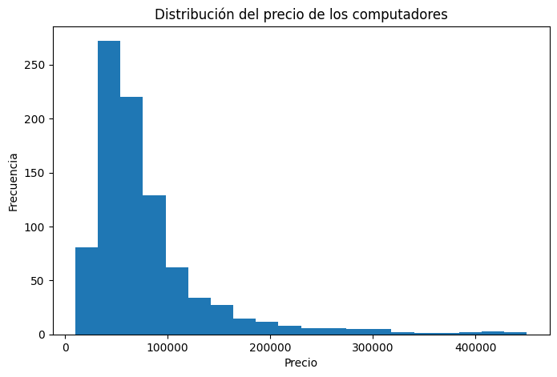

# 📊 Métodos Cuantitativos con Python

Repositorio destinado al desarrollo de ejercicios y proyectos del curso de Métodos Cuantitativos utilizando Python y Google Colab.

## 🎯 Objetivo

Aplicar técnicas de análisis estadístico utilizando Python sobre conjuntos de datos reales, desarrollando notebooks reproducibles que sirvan como material de estudio y portafolio personal.

## 📁 Estructura del repositorio

```
metodos-cuantitativos-python/
│
├── notebooks/
│   └── 01_Estadistica_Descriptiva_Laptop_Prices.ipynb
│
├── data/
│   └── Laptop_Price_Prediction_Dataset.xlsx
│
├── images/
│
└── README.md
```

## 📚 Contenido

### 01. Estadística Descriptiva
- Carga y preparación del conjunto de datos.
- Exploración inicial.
- Medidas de tendencia central.
- Medidas de dispersión.
- Medidas de posición.
- Visualizaciones.
- Conclusiones.

## 🛠 Tecnologías utilizadas

- Python
- Google Colab
- Pandas
- NumPy
- Matplotlib
- Seaborn

## 📂 Dataset

**Laptop Price Prediction Dataset**

https://www.kaggle.com/datasets/jacksondivakarr/laptop-price-prediction-dataset


## Vista previa




## 🚀 Estado del repositorio

- ✅ 01. Estadística Descriptiva
- ⏳ 02. Probabilidad
- ⏳ 03. Variables Aleatorias
- ⏳ 04. Distribuciones de Probabilidad
- ⏳ 05. Inferencia Estadística
- ⏳ 06. Regresión
